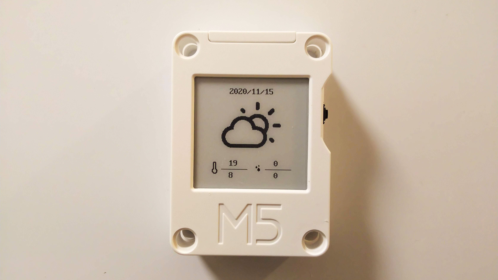

# CoreInk-Weather



M5Stack CoreInkで天気が表示できます。

## 実装済みの機能

* 天気の定期更新 (現在は1時間ごとに設定しています)
* 電池残量が少ない時の定期更新の停止および警告表示
* 18時以降は翌日の天気を表示する
* NTPを用いた時刻合わせ

## 天気を取得する地域の設定方法

1. [気象庁｜天気予報](https://www.jma.go.jp/bosai/forecast/) にアクセスします。
2. 上部の「都道府県選択」より、お住まいの都道府県を選択します。
3. URLを確認し、`area_code=` の後に記載されている数字を「エリアコード」とします。
4. 天気予報ページ左部に記載されている地方のうち、お住まいの地域に合致するものを「地域」とします。
5. CoreInk-Weather.ino 33行目付近にあるコードを下記のように修正します。

``` C++
const char* endpoint = "https://www.jma.go.jp/bosai/forecast/data/forecast/[エリアコード].json";
const char* region = "[地域]";
```

### 例

``` C++
const char* endpoint = "https://www.jma.go.jp/bosai/forecast/data/forecast/130000.json";
const char* region = "東京地方";
```

## 参考

[天気予報をM5Stackで表示してみた \- クラクスの記録帳](https://kuracux.hatenablog.jp/entry/2019/07/13/101143)

## 使用ツール

[coreink-image-converter](https://github.com/wararyo/coreink-image-converter)

## Credits

[Weather Icons](https://erikflowers.github.io/weather-icons/)
